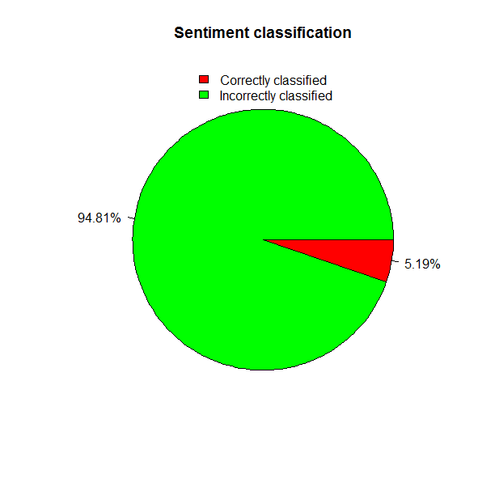
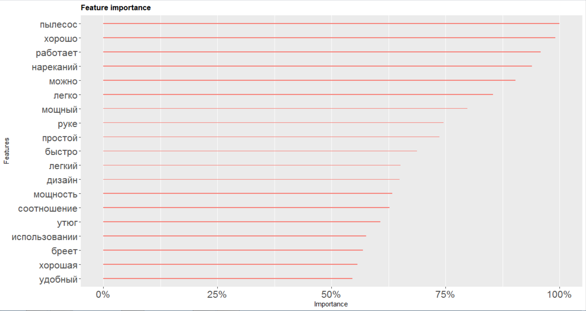

# Reviews Classification
[The data](https://drive.google.com/file/d/1HLrP0O5bkOK1X4Z4CMBxbGLHF6x9xht6/view?usp=sharing) consists of 743323 user reviews of the products available on the ["Rozetka" site](https://rozetka.com.ua/ua/), a leading Ukrainian e-commerce company). Every user has the opportunity to specify advantages ("Advantages" column) and drawbacks ("Drawbacks" column) of a product. Also, some additional variables are available for each product.
We created a model which accurately (0.9487728) classified the sentiment (drawbacks / advantages) of the user reviews about "Small household appliances" product category

and reveal the  features of this type of product which are important to customers. 

